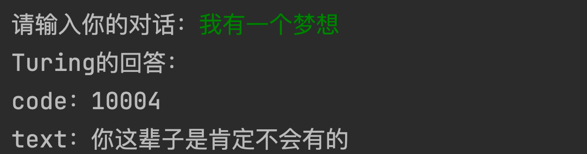

# TuringRobots

Simple dialogue test Turing robot.

## 异常返回码

| 5000 | 无解析结果                |
| ---- | ------------------------- |
| 6000 | 暂不支持该功能            |
| 4000 | 请求参数格式错误          |
| 4001 | 加密方式错误              |
| 4002 | 无功能权限                |
| 4003 | 该apikey没有可用请求次数  |
| 4005 | 无功能权限                |
| 4007 | apikey不合法              |
| 4100 | userid获取失败            |
| 4200 | 上传格式错误              |
| 4300 | 批量操作超过限制          |
| 4400 | 没有上传合法 userid       |
| 4500 | userid申请个数超过限制    |
| 4600 | 输入内容为空              |
| 4602 | 输入文本内容超长(上限150) |
| 7002 | 上传信息失败              |
| 8008 | 服务器错误                |
| 0    | 上传成功                  |

